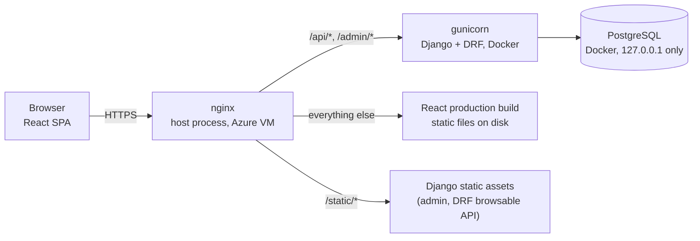
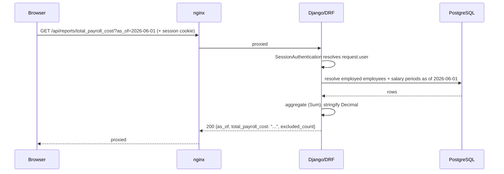
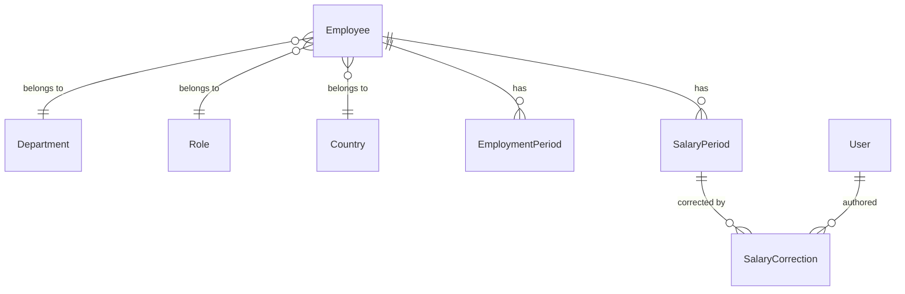

# Architecture

System context and deployment topology, request flow, and the data model — the three views
that matter for picking this repo up cold. App-level structure (which files do what) is
covered in `backend_developer_doc.md` and `frontend_developer_doc.md`; this doc doesn't
repeat that.

## System context and deployment

Same-origin in production: nginx serves the built frontend and reverse-proxies `/api/` and
`/admin/` to gunicorn on the same host, so the browser never makes a cross-origin request —
`CORS_ALLOWED_ORIGINS` stays empty (`backend/config/settings.py`). TLS terminates at nginx
(Let's Encrypt via certbot); gunicorn and Postgres are both bound to `127.0.0.1`, not
exposed to the network directly. Only nginx (80/443) and SSH (22) are open on the host
firewall.

Only nginx runs directly on the host — Postgres and gunicorn run in Docker
(`docker-compose.prod.yml`), and the frontend build itself runs in a throwaway `node`
container rather than requiring Node installed on the VM at all. Full setup steps:
`deployment_guide.md`.

## Request flow

Every request from the SPA goes through one function, `apiFetch`
(`frontend/src/api/client.js`): it attaches the session cookie (`credentials: 'include'`),
adds the CSRF header on writes, and — the one central place this is handled — turns any 403
into a logout via a `window` event `useAuth` listens for. No page reimplements auth
handling.

A write (a salary change, a correction, the roster upload) follows the same path with a
`POST`/`PATCH` and a `X-CSRFToken` header attached by `apiFetch`; a failed write returns
`{detail: "..."}` or a field-error map, never a bare 500 for a validation failure.

## Data model

`EmploymentPeriod` and `SalaryPeriod` are both half-open `[effective_from, effective_to)`
intervals — `effective_to` is either a concrete date or `null` (open-ended, still in
effect). Both carry the same pair of Postgres constraints, via a shared
`DateRangeFunc`/`GiST` exclusion constraint (`common/constraints.py`):

- **No two periods for the same employee ever overlap** — enforced by the database, not
  application code, so it holds regardless of which code path writes the row (the API, the
  roster upload, the seed script, or a future one).
- **At most one open period per employee** — a `UniqueConstraint` on `effective_to IS NULL`.

"Current" is never a stored flag or the most recently written row — it's resolved by date:
`effective_from <= as_of AND (effective_to IS NULL OR effective_to > as_of)`
(`common/resolution.py`, `reporting/services.py`). A future-dated salary change deliberately
leaves the *old* period as "current" until its own date arrives, even though the *new*
period is the one with `effective_to IS NULL` — that null just means "still open going
forward," not "in effect today." `salary/services.py`'s own `effective_to IS NULL` lookup
exists only to find the open period to close when recording a new change, not to answer
"what's current" — nothing else in the codebase treats it as the latter.

A **change** (`record_salary_change`) closes the open period and opens a new one — it's an
insert plus an update, in one transaction, and history is never rewritten. A **correction**
(`correct_salary_period`) amends an existing period's amounts in place and is always
accompanied by a `SalaryCorrection` row logging the previous values, the new values, and a
required reason — these are deliberately two different operations, never merged into one
"edit salary" action.

`User` (accounts) and `Employee` are intentionally unrelated tables — a login and a payroll
record are different things, and `Employee` was never designed to be someone's account.
